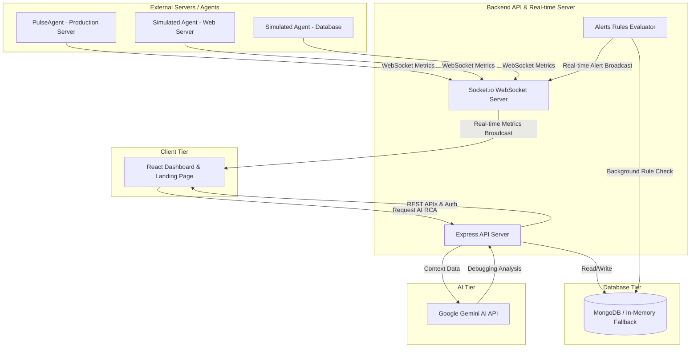

# 🛡️ PulseSentry | Real-Time APM & Infrastructure Monitoring Platform

PulseSentry is a production-grade, real-time Application Performance Monitoring (APM) and server infrastructure surveillance platform built on the MERN stack. Designed with system engineering principles in mind, it provides low-latency telemetry streaming, threshold-based incident alerting, and Google Gemini AI-powered root cause analysis (RCA).

---

## ⚡ Key Architectural Capabilities

- **🚀 Low-Latency Real-Time Telemetry**: Real-time bidirectional streaming of system metrics (CPU, RAM, Disk I/O, Network Throughput, Node.js event-loop lag) using a persistent WebSocket connection (`socket.io`).
- **🧠 AI-Powered Root Cause Analysis (RCA)**: Instantly diagnose system failures. PulseSentry integrates Google Gemini AI to analyze historical metric buffers, server event logs, and active process lists, outputting detailed diagnostic reports with remediation terminal commands.
- **⚙️ Dynamic Alerting & Rules Engine**: A background rules evaluation loop that inspects incoming telemetry stream data against customizable threshold logic (e.g., `CPU > 90% for 10s`) and broadcasts push notifications instantly.
- **🖥️ Standalone Systems Monitoring Agent**: A native agent script (`agent/pulseAgent.js`) using the `systeminformation` library. It can be run on any production machine to capture OS-level telemetry and stream it securely to your PulseSentry server.
- **🔄 Robust Zero-Config Fallbacks**: 
  - *Database*: Automatic fallback to a mock, in-memory store if MongoDB is unavailable, guaranteeing an instant out-of-the-box boot.
  - *Gemini AI*: Automatic fallback to simulated diagnostic templates if no Gemini API Key is configured.
- **🎭 Multi-Host Simulator**: An in-app agent simulator control deck to trigger artificial memory leaks, CPU thrashing, or high network payloads across multiple virtual nodes to test alert engine compliance.

---

## 🏗️ System Architecture



---

## 🛠️ Technology Stack

- **Frontend**: React 19, Vite, Tailwind CSS, Lucide Icons, Responsive Custom SVG Chart Engine.
- **Backend**: Node.js, Express, Socket.io (WebSocket), JWT Auth, bcryptjs.
- **Database**: MongoDB & Mongoose (with full in-memory fallback).
- **AI Integration**: `@google/generative-ai` (Gemini API).
- **Agent**: Node.js systems daemon using `systeminformation` & `socket.io-client`.

---

## 🚀 Getting Started

### 1. Prerequisites
- Node.js (v18+ recommended)
- MongoDB (Optional, the app runs on a mock database if MongoDB is not present)

### 2. Installation & Setup
Clone the repository and install all dependencies:
```bash
npm install
```

### 3. Environment Variables
Create a `.env` file in the root directory (the server will automatically load this):
```env
PORT=5000
MONGODB_URI=mongodb://localhost:27017/pulsesentry
JWT_SECRET=your_jwt_secret_token_here
GEMINI_API_KEY=your_gemini_api_key_here
```
*(Note: If `GEMINI_API_KEY` is left blank, the app will run with a simulated diagnostic fallback).*

### 4. Running the Application
Start the frontend dev server and the backend API server concurrently with a single command:
```bash
npm run dev
```
Open `http://localhost:5173` in your browser.

### 5. Running the Telemetry Agent
To monitor your actual local computer or a remote server:
1. Open a new terminal window.
2. Navigate to the project folder.
3. Run the standalone agent script:
```bash
node agent/pulseAgent.js
```
The agent will establish a WebSocket handshake with the server, auto-register your hostname, and start streaming live system telemetry directly to the dashboard!

---

## 📈 Portfolio Highlights

This project was built to demonstrate:
1. **Concurrency**: Seamless management of concurrent real-time client UI connections and background telemetry agent streams on a single Node server.
2. **Resilience**: Designing applications that fail gracefully (dynamic database fallback & mock-AI integration), making them highly reliable for recruiters and evaluators.
3. **Advanced Networking**: Direct manipulation of WebSockets using `socket.io` for high-frequency time-series datasets.
4. **Clean Code**: High-fidelity React hooks, customized modular page layouts, and isolated REST routers.
